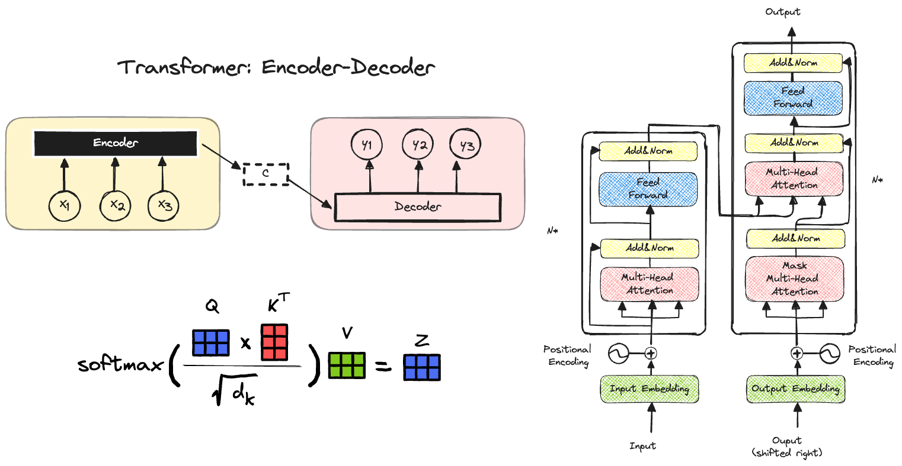

# Machine Learning Scientist: Store Telling

## Reasons

The saying "a picture is worth a thousand words" applies very well to machine learning, especially in the field of computer science and engineering.  A well-chosen image will provide the most relevant and informative data for the machine learning task.

- Data Efficiency: A single image can convey a vast amount of information. 
- Capturing Complexities: Images can capture subtleties and nuances that would be difficult or even impossible to describe with words. 
- Direct Learning: Our brains are wired to process visual information very effectively.  

## Machine Learning

### Decision Trees

### Transformer

## Cyber Security

### HTTPS Technology

### Local Networks

### More to Come ... 

**END**
